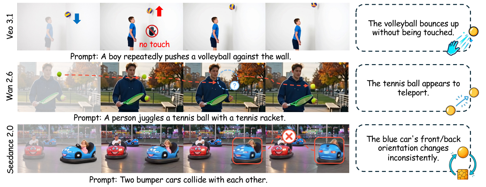
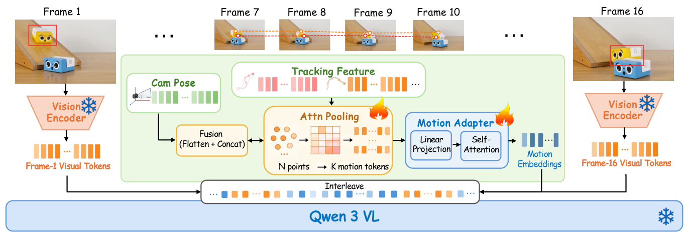

<p align="center">
  <picture>
    <source media="(prefers-color-scheme: dark)" srcset="assets/motioninsight-header-dark.svg">
    <source media="(prefers-color-scheme: light)" srcset="assets/motioninsight-header-light.svg">
    
  </picture>
</p>

<h1 align="center">MotionInsight: Diagnosing Object Motion<br>Deficiencies in Generated Videos</h1>

<p align="center"><strong>EMNLP 2026 Findings</strong></p>

<p align="center">
  Jiahao Zhan<sup>1,2</sup>, Yongrui Ma<sup>1,2</sup>, Qunliang Xing<sup>2</sup>, Xuanyu Zhang<sup>4</sup>,<br>
  Jingqi Tong<sup>3</sup>, Junlin Li<sup>2</sup>, Li Zhang<sup>2</sup>, Shijie Zhao<sup>2,†,✉</sup>, Tianfan Xue<sup>1,5,✉</sup>
</p>
<p align="center">
  <sup>1</sup>MMLab, CUHK &nbsp; <sup>2</sup>ByteDance Inc. &nbsp; <sup>3</sup>Fudan University<br>
  <sup>4</sup>Peking University &nbsp; <sup>5</sup>CPII under InnoHK<br>
  <sub>† Project Lead &nbsp; ✉ Corresponding Authors</sub>
</p>

<p align="center">
  <a href="paper.pdf"></a>
  <a href="https://huggingface.co/JohnZhan/MotionInsight-8B"></a>
  <a href="#installation"></a>
  <a href="LICENSE"></a>
</p>

<p align="center">
  <a href="#overview">Overview</a> ·
  <a href="#extract-motion-features">Preprocessing</a> ·
  <a href="#inference">Inference</a> ·
  <a href="#grpo">GRPO</a> ·
  <a href="#citation">Citation</a>
</p>

## Overview

MotionInsight evaluates the motion of a designated object in a generated video,
producing diagnostic reasoning and three scores from **1 (poor)** to **5 (excellent)**.
This repository provides inference, motion-feature extraction, and GRPO fine-tuning code.

| Dimension | Output field |
|---|---|
| Object consistency | `structural_stability` |
| Motion continuity | `motion_coherence` |
| Physical plausibility | `physical_plausibility` |

<p align="center"></p>
<p align="center"></p>

## Installation

Use Python 3.10 and separate environments for inference and preprocessing.

```bash
git clone --recurse-submodules https://github.com/JohnZhan2023/MotionInsight.git
cd MotionInsight
python3.10 -m venv .venv-model
source .venv-model/bin/activate
python -m pip install --upgrade pip
python -m pip install torch==2.11.0 torchvision==0.26.0 \
  --index-url https://download.pytorch.org/whl/cu126
python -m pip install -r requirements.txt

hf download JohnZhan/MotionInsight-8B --local-dir checkpoints/MotionInsight-8B
python scripts/patch_transformers.py
python scripts/patch_transformers.py --check
```

The motion-aware model requires the included patch for `transformers==4.57.1`.
Weights use BF16 and occupy approximately 17.7 GB; runtime memory also depends on
video length and resolution.

## Extract motion features

<details>
<summary>Preprocessing environment setup</summary>

```bash
deactivate
python3.10 -m venv .venv-preprocess
source .venv-preprocess/bin/activate
python -m pip install --upgrade pip
python -m pip install torch==2.7.0 torchvision==0.22.0 \
  --index-url https://download.pytorch.org/whl/cu128
python -m pip install -r requirements/preprocess.txt
python -m pip install -c requirements/preprocess.txt \
  -e thirdparty/co-tracker -e thirdparty/sam3
python -m pip install -c requirements/preprocess.txt \
  --no-build-isolation -e thirdparty/vipe
```

VIPE needs a compatible CUDA toolkit with `nvcc` and a C++ compiler.
Follow the model-weight setup in [SAM3](thirdparty/sam3/README.md),
[CoTracker3](thirdparty/co-tracker/README.md), and [VIPE](thirdparty/vipe/README.md).

</details>

In `.venv-preprocess`, extract object and camera motion from the same video:

```bash
python motion_features/extract_object_motion.py \
  --video /path/to/video.mp4 --target "tennis ball" \
  --sam-checkpoint /path/to/sam3.pt \
  --cotracker-checkpoint /path/to/scaled_offline.pth \
  --output outputs/object_motion.pt

python motion_features/extract_camera_motion.py \
  --video /path/to/video.mp4 --output outputs/camera_motion.pt
```

## Inference

Switch back to `.venv-model` and run:

```bash
source .venv-model/bin/activate
python inference.py \
  --model_name_or_path checkpoints/MotionInsight-8B \
  --video_path /path/to/video.mp4 \
  --object_motion_path outputs/object_motion.pt \
  --camera_motion_path outputs/camera_motion.pt \
  --target "tennis ball" \
  --output_path outputs/prediction.jsonl
```

Example answer format:

```text
<thinking>Diagnostic reasoning about the target object's motion.</thinking>
<answer>{"structural_stability": 3.0, "physical_plausibility": 4.5, "motion_coherence": 3.5}</answer>
```

For batch inference, use `--dataset_path inputs.jsonl`; run `python inference.py --help`
for available options. Keep the original video timeline when using extracted features.

## GRPO

The [GRPO launcher](training/run_grpo.sh) fine-tunes a motion-aware model on eight GPUs:

```bash
python -m pip install -r requirements/train.txt
ATTN_IMPLEMENTATION=sdpa bash training/run_grpo.sh \
  checkpoints/MotionInsight-8B /path/to/train.jsonl outputs/motioninsight-grpo
```

Use `ATTN_IMPLEMENTATION=flash_attention_2` if a compatible FlashAttention build is installed.
Each JSONL record contains the video, motion features, target object, question, and reference answer:

```json
{"path":"/path/to/video.mp4","object_motion":"outputs/object_motion.pt","camera_motion":"outputs/camera_motion.pt","target":"tennis ball","data_type":"video","problem_type":"regression","problem":"Evaluate the target object's motion quality.","solution":"<thinking>Reference reasoning.</thinking><answer>{\"structural_stability\":3.0,\"physical_plausibility\":4.5,\"motion_coherence\":3.5}</answer>"}
```

## Citation

```bibtex
@inproceedings{zhan2026motioninsight,
  title  = {MotionInsight: Diagnosing Object Motion Deficiencies in Generated Videos},
  author = {Zhan, Jiahao and Ma, Yongrui and Xing, Qunliang and Zhang, Xuanyu and Tong, Jingqi and Li, Junlin and Li, Zhang and Zhao, Shijie and Xue, Tianfan},
  booktitle = {Findings of the Association for Computational Linguistics: EMNLP 2026},
  year   = {2026}
}
```

## License

MotionInsight code and weights use [Apache-2.0](LICENSE). Third-party components
retain their licenses: CoTracker (CC BY-NC 4.0), SAM3 (SAM License), and VIPE
(Apache-2.0). See [NOTICE](NOTICE) for attribution and component license locations.
